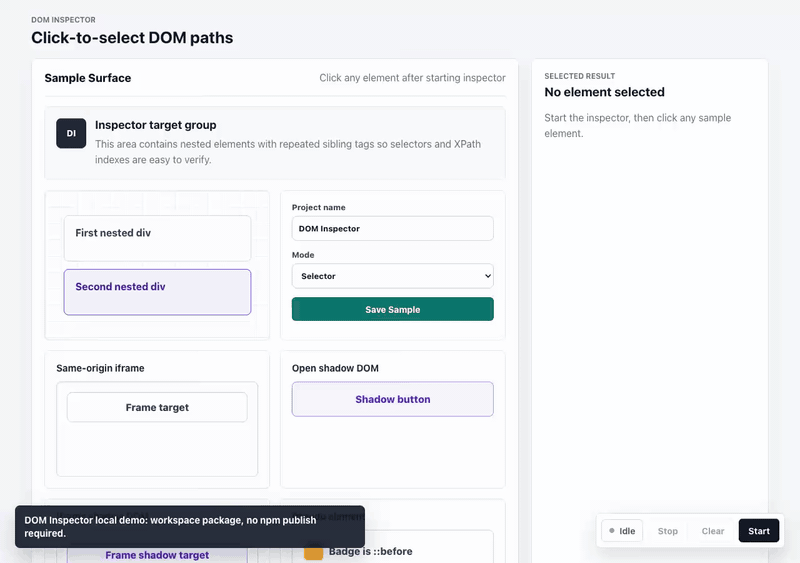

# DOM Inspector

A lightweight browser-side DOM inspector library for selecting an element and
returning stable selector, XPath, JS path, iframe, shadow DOM, and
pseudo-element information.

## Demo

[](docs/demo.mp4)

## Workspace

- `packages/dom-inspector`: TypeScript library.
- `apps/web`: Vite + React + TypeScript demo page.

## Local Setup

This package has not been published to npm yet. Use the workspace package while
developing locally.

```bash
pnpm install
pnpm dev
```

The demo app runs through `@hereorcode/dom-inspector` as a workspace dependency.
Open the local Vite URL printed by `pnpm dev`, start the inspector, then click
sample elements to inspect their generated paths.

## Library Usage

Inside this workspace, import the package by its package name:

```ts
import { createDOMInspector } from "@hereorcode/dom-inspector";

const inspector = createDOMInspector({
  selectionScope: { modifierKey: "Alt" },
  onSelect(result) {
    console.log(result.selector);
    console.log(result.xpath);
    console.log(result.jsPath);
  }
});

inspector.start();
```

Hold `Alt`/`Option` while scrolling to expand or shrink the current hover scope
before clicking. Pass `selectionScope: false` to disable this behavior.

Call `stop()` to remove active listeners and overlays without destroying the
instance. Call `destroy()` when the inspector is no longer needed.

The selected result includes:

```ts
type DOMInspectResult = {
  element: Element;
  ownerDocument: Document;
  rootKind: "document" | "iframe" | "shadow";
  selector: string;
  selectorWithPseudo: string;
  xpath: string;
  fullXPath: string;
  jsPath: string;
  framePath: DOMInspectorFramePath[];
  shadowPath: DOMInspectorShadowPath[];
  pseudoElement: "::before" | "::after" | null;
  pseudoElements: PseudoElementInfo[];
  pseudoElementRect: RectLike | null;
  rect: DOMRect;
  event: MouseEvent;
};
```

Example output:

```txt
selector: body > main > div > div > div:nth-child(2)
xpath: /html/body/main/div/div/div[2]
jsPath: document.querySelector("body > main > div > div > div:nth-child(2)")
```

## Local Package Development

Build the library before consuming its `dist` output from another local project:

```bash
pnpm --filter @hereorcode/dom-inspector build
```

Until the package is published, use a workspace dependency, `pnpm link`, or a
local file dependency from the consuming project. After publishing, this section
can switch to the normal published-package installation flow.

## Edge Cases

- Same-origin iframes are inspected recursively. For elements inside a frame,
  `selector` and `xpath` are local to that frame document, while `jsPath`
  includes the frame hop from the top-level document, for example:

```txt
document.querySelector("body > iframe").contentDocument.querySelector("body > main > button")
```

- Cross-origin iframes cannot expose their internal DOM to page JavaScript.
  Browser security only allows selecting the `<iframe>` element itself.

- Open Shadow DOM is supported through event `composedPath()`. The returned
  `jsPath` includes `.shadowRoot.querySelector(...)`. Closed Shadow DOM cannot
  expose internal elements to external code, so the host element is selected.

- Same-origin iframes and open Shadow DOM can be combined. The returned `jsPath`
  composes both hops, for example:

```txt
document.querySelector("body > iframe").contentDocument.querySelector("body > main > div").shadowRoot.querySelector("button")
```

- Pseudo-elements such as `::before` and `::after` are not real DOM elements.
  The library returns the owning element, lists visible pseudo-elements in
  `pseudoElements`, and sets `pseudoElement` plus `selectorWithPseudo` when a
  positioned pseudo-element's visible region is hit.

## Development

```bash
pnpm install
pnpm dev
pnpm typecheck
pnpm test
pnpm build
```

## Repository Maintenance

Use `scripts/reset-repo-history.sh` only when intentionally resetting the
repository to a single fresh commit. The script deletes existing tags, creates a
new initial commit from the current files, recreates the requested tag, and can
force-push the target branch and tag to the remote.

Always preview the plan first:

```bash
scripts/reset-repo-history.sh --tag v0.1.0 --dry-run
```

Run the reset only from a clean working tree:

```bash
scripts/reset-repo-history.sh --tag v0.1.0 --execute
```

The script creates a `git bundle` backup by default before rewriting history.
Remote branch protection can block the push, and GitHub Releases may need to be
deleted manually after old tags are removed.
